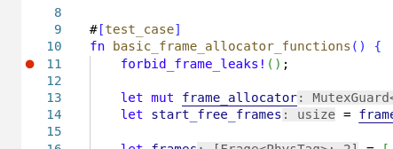
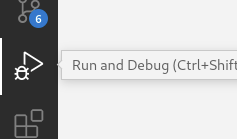
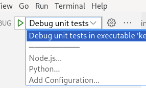
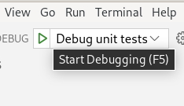

## Настройка VSCode

Для работы в VSCode нужно установить два плагина.

 1. [rust-analyzer](https://marketplace.visualstudio.com/items?itemName=rust-lang.rust-analyzer)
 2. [CodeLLDB](https://marketplace.visualstudio.com/items?itemName=vadimcn.vscode-lldb)

В конфигурации
[rust-analyzer](https://marketplace.visualstudio.com/items?itemName=rust-lang.rust-analyzer)
[нужно установить опцию `rust-analyzer.checkOnSave.allTargets` в `false`](https://github.com/rust-lang/rust-analyzer/issues/10659#issuecomment-954739511).

После этого нужно открыть репозиторий `File -> Open Folder`.
Открывать нужно либо подпапку `sem` для семинарских домашек, либо `kernel` или `ku` для лабораторок.
Если открывать корень репозитория, то работать не будет.
Аналогично `cargo test ...` нужно запускать либо в папке `sem/...`, либо в `kernel` или `ku` ---
это будет уточнено в каждой задаче лабораторок.
Это из-за того что `sem` запускается в одном окружении --- под Linux.
А Nikka в другом --- freestanding.
А `cargo` и VSCode к такому не готовы.

VSCode поддерживает отладку ядра. Чтобы запустить отладку, нужно поставить breakpoint в интерфейсе редактора кода, перейти в `Run and Debug` (иконка с жуком слева), выбрать конфигурацию запуска и нажать на иконку `Start Debugging`.

