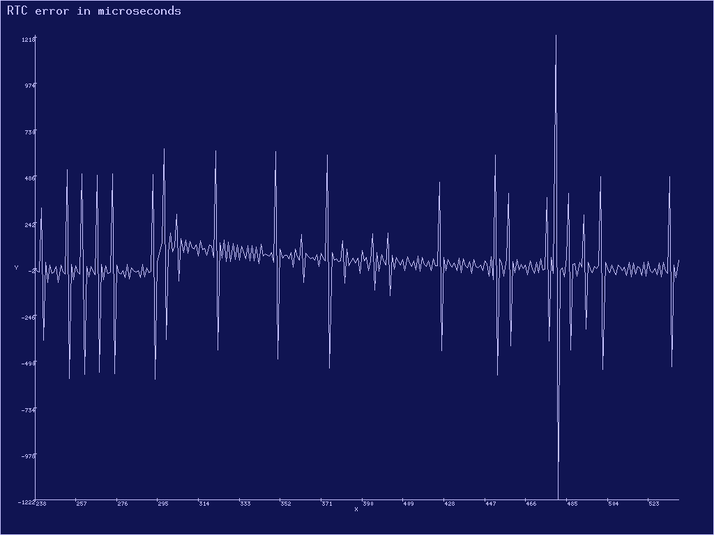
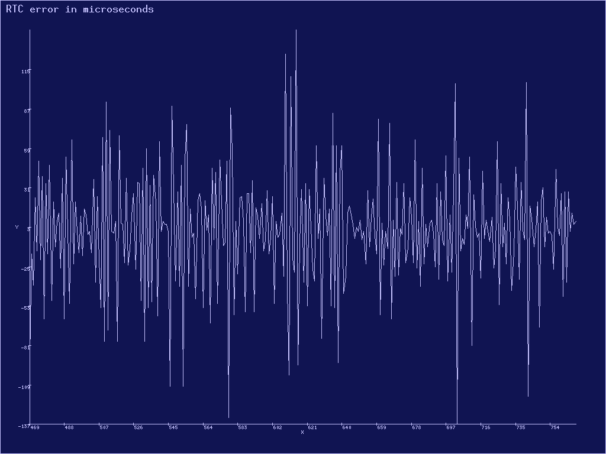

### Аллокатор больших блоков памяти

План состоит в том, чтобы

- Для [`kernel::allocator::Big`](../../doc/kernel/allocator/big/struct.Big.html) реализовать типаж [`ku::allocator::big::BigAllocator`](../../doc/ku/allocator/big/trait.BigAllocator.html). Этот пункт уже частично сделан, остался один метод --- [`BigAllocator::copy_mapping()`](../../doc/ku/allocator/big/trait.BigAllocator.html#tymethod.copy_mapping).
- Для типажа [`ku::allocator::big::BigAllocator`](../../doc/ku/allocator/big/trait.BigAllocator.html) реализовать типаж [`ku::allocator::dry::DryAllocator`](../../doc/ku/allocator/dry/trait.DryAllocator.html).
- Определить тип [`kernel::allocator::memory_allocator::MemoryAllocator`](../../doc/kernel/allocator/memory_allocator/struct.MemoryAllocator.html) и реализовать для него типаж [`core::alloc::Allocator`](https://doc.rust-lang.org/nightly/core/alloc/trait.Allocator.html) через реализованный ранее [`ku::allocator::dry::DryAllocator`](../../doc/ku/allocator/dry/trait.DryAllocator.html). Этот пункт уже сделан в файле [`kernel/src/allocator/memory_allocator.rs`](https://gitlab.com/sergey-v-galtsev/nikka-public/-/blob/master/kernel/src/allocator/memory_allocator.rs).

После этого станет доступен глобальный аллокатор памяти общего назначения
[`kernel::allocator::GLOBAL_ALLOCATOR`](../../doc/kernel/allocator/static.GLOBAL_ALLOCATOR.html).
Он использует
[`kernel::allocator::memory_allocator::MemoryAllocator`](../../doc/kernel/allocator/memory_allocator/struct.MemoryAllocator.html)
поверх базового адресного пространства
[`kernel::memory::BASE_ADDRESS_SPACE`](../../doc/kernel/memory/static.BASE_ADDRESS_SPACE.html)
и определён в файле
[`kernel/src/allocator/mod.rs`](https://gitlab.com/sergey-v-galtsev/nikka-public/-/blob/master/kernel/src/allocator/mod.rs).


### Задача 1 --- аллокатор больших блоков памяти

Реализуйте метод
[`copy_mapping()`](../../doc/kernel/allocator/big/struct.Big.html#method.copy_mapping)
типажа
[`ku::allocator::big::BigAllocator`](../../doc/ku/allocator/big/trait.BigAllocator.html)
для
[`kernel::allocator::Big`](../../doc/kernel/allocator/big/struct.Big.html)
в файле
[`kernel/src/allocator/big.rs`](https://gitlab.com/sergey-v-galtsev/nikka-public/-/blob/master/kernel/src/allocator/big.rs):

```rust
unsafe fn copy_mapping(
    &mut self,
    old_block: Block<Page>,
    new_block: Block<Page>,
    flags: Option<PageTableFlags>,
) -> Result<()>;
```

Он копирует отображение физических фреймов из `old_block` в `new_block`.
Если изначально `new_block` содержал отображённые страницы,
их отображение удаляется.
Физические фреймы, на которые не осталось других ссылок, освобождаются.
После работы `copy_mapping()` содержимое памяти, которое ранее было доступно через `old_block`,
становится доступным ещё и через `new_block`.
Параметр `flags` задаёт флаги доступа к страницам `new_block`:
- `None` --- использовать те же флаги, что и в `old_block`, индивидуально для каждой страницы.
- `Some` --- использовать для всех страниц флаги `flags`.

Если `old_block` и `new_block` имеют разный размер или пересекаются,
за исключением случая совпадения при `flags == Some(...)`,
метод `copy_mapping()` возвращает ошибку
[`Error::InvalidArgument`](../../doc/ku/error/enum.Error.html#variant.InvalidArgument).

Реализуйте методы типажа
[`ku::allocator::dry::DryAllocator`](../../doc/ku/allocator/dry/trait.DryAllocator.html)
для типа, который уже реализует типаж
[`ku::allocator::big::BigAllocator`](../../doc/ku/allocator/big/trait.BigAllocator.html)
в файле
[`ku/src/allocator/big.rs`](https://gitlab.com/sergey-v-galtsev/nikka-public/-/blob/master/ku/src/allocator/big.rs).
При этом с виртуальным адресным пространством работайте через
[`ku::allocator::big::BigAllocator::reserve()`](../../doc/ku/allocator/big/trait.BigAllocator.html#tymethod.reserve),
[`ku::allocator::big::BigAllocator::unreserve()`](../../doc/ku/allocator/big/trait.BigAllocator.html#tymethod.unreserve) и
[`ku::allocator::big::BigAllocator::rereserve()`](../../doc/ku/allocator/big/trait.BigAllocator.html#tymethod.unreserve).
А чтобы менять его отображение на физическую память, используете
[`ku::allocator::big::BigAllocator::map()`](../../doc/ku/allocator/big/trait.BigAllocator.html#tymethod.map),
[`ku::allocator::big::BigAllocator::unmap()`](../../doc/ku/allocator/big/trait.BigAllocator.html#tymethod.unmap)
и
[`ku::allocator::big::BigAllocator::copy_mapping()`](../../doc/ku/allocator/big/trait.BigAllocator.html#tymethod.copy_mapping).
Естественно, все выдаваемые блоки памяти будут выровнены на границы страниц и по адресу и по размеру.

Вам могут пригодиться методы [`ku::memory::block::Block`](../../doc/ku/memory/block/struct.Block.html), например:

- [`Block::count()`](../../doc/ku/memory/block/struct.Block.html#method.count),
- [`Block::from_index()`](../../doc/ku/memory/block/struct.Block.html#method.from_index),
- [`Block::is_disjoint()`](../../doc/ku/memory/block/struct.Block.html#method.is_disjoint),
- [`Block::tail()`](../../doc/ku/memory/block/struct.Block.html#method.tail),
- [`Block::try_into_non_null_slice()`](../../doc/ku/memory/block/struct.Block.html#method.try_into_non_null_slice).

А также вспомогательные функции, определённые в том же файле
[`ku/src/allocator/big.rs`](https://gitlab.com/sergey-v-galtsev/nikka-public/-/blob/master/ku/src/allocator/big.rs):

- [`ku::allocator::big::try_into_block()`](../../doc/ku/allocator/big/fn.try_into_block.html)
- [`ku::allocator::big::initialize_block()`](../../doc/ku/allocator/big/fn.initialize_block.html).

В зависимости от вашей реализации `dry_shrink()`, вам может пригодиться или не пригодиться метод
[`BigAllocator::rereserve()`](../../doc/ku/allocator/big/trait.BigAllocator.html#tymethod.unreserve).

При реализации учтите, что даже если `old_layout` и `new_layout` в `dry_grow()` и `dry_shrink()` отличаются,
но при этом не отличаются соответствующие им блоки страниц `Block<Page>`,
то ничего делать не нужно.
Можно вернуть на выход срез со старым адресом, приведённый к новому размеру.


### Проверьте себя

Запустите тест `3-smp-1-big-memory-allocator` из файла
[`kernel/tests/3-smp-1-big-memory-allocator.rs`](https://gitlab.com/sergey-v-galtsev/nikka-public/-/blob/master/kernel/tests/3-smp-1-big-memory-allocator.rs):

```console
$ (cd kernel; cargo test --test 3-smp-1-big-memory-allocator)
...
3_smp_1_big_memory_allocator::basic-------------------------
17:22:56 0 D start_info = { allocations: 0 - 0 = 0, requested: 0 B - 0 B = 0 B, allocated: 0 B - 0 B = 0 B, pages: 0 - 0 = 0, loss: 0 B = 0.000% }
17:22:56 0 D box_contents = 2
17:22:56 0 D allocator_info = { total: { allocations: 1 - 0 = 1, requested: 4 B - 0 B = 4 B, allocated: 4.000 KiB - 0 B = 4.000 KiB, pages: 1 - 0 = 1, loss: 3.996 KiB = 99.902% }, fallback: { allocations: 1 - 0 = 1, requested: 4 B - 0 B = 4 B, allocated: 4.000 KiB - 0 B = 4.000 KiB, pages: 1 - 0 = 1, loss: 3.996 KiB = 99.902% } }
17:22:56 0 D info = { allocations: 1 - 0 = 1, requested: 4 B - 0 B = 4 B, allocated: 4.000 KiB - 0 B = 4.000 KiB, pages: 1 - 0 = 1, loss: 3.996 KiB = 99.902% }
17:22:56 0 D info_diff = { allocations: 1 - 0 = 1, requested: 4 B - 0 B = 4 B, allocated: 4.000 KiB - 0 B = 4.000 KiB, pages: 1 - 0 = 1, loss: 3.996 KiB = 99.902% }
17:22:56 0 D allocator_info = { total: { allocations: 1 - 1 = 0, requested: 4 B - 4 B = 0 B, allocated: 4.000 KiB - 4.000 KiB = 0 B, pages: 1 - 1 = 0, loss: 0 B = 0.000% }, fallback: { allocations: 1 - 1 = 0, requested: 4 B - 4 B = 0 B, allocated: 4.000 KiB - 4.000 KiB = 0 B, pages: 1 - 1 = 0, loss: 0 B = 0.000% } }
17:22:56 0 D end_info = { allocations: 1 - 1 = 0, requested: 4 B - 4 B = 0 B, allocated: 4.000 KiB - 4.000 KiB = 0 B, pages: 1 - 1 = 0, loss: 0 B = 0.000% }
17:22:56 0 D end_info_diff = { allocations: 1 - 1 = 0, requested: 4 B - 4 B = 0 B, allocated: 4.000 KiB - 4.000 KiB = 0 B, pages: 1 - 1 = 0, loss: 0 B = 0.000% }
3_smp_1_big_memory_allocator::basic---------------- [passed]

3_smp_1_big_memory_allocator::grow_and_shrink---------------
17:22:56 0 D start_info = { allocations: 1 - 1 = 0, requested: 4 B - 4 B = 0 B, allocated: 4.000 KiB - 4.000 KiB = 0 B, pages: 1 - 1 = 0, loss: 0 B = 0.000% }
17:22:56 0 D contents_sum = 75491328; push_sum = 75491328
17:22:56 0 D allocator_info = { total: { allocations: 14 - 13 = 1, requested: 255.973 KiB - 127.973 KiB = 128.000 KiB, allocated: 284.000 KiB - 156.000 KiB = 128.000 KiB, pages: 71 - 39 = 32, loss: 0 B = 0.000% }, fallback: { allocations: 14 - 13 = 1, requested: 255.973 KiB - 127.973 KiB = 128.000 KiB, allocated: 284.000 KiB - 156.000 KiB = 128.000 KiB, pages: 71 - 39 = 32, loss: 0 B = 0.000% } }
17:22:56 0 D info = { allocations: 14 - 13 = 1, requested: 255.973 KiB - 127.973 KiB = 128.000 KiB, allocated: 284.000 KiB - 156.000 KiB = 128.000 KiB, pages: 71 - 39 = 32, loss: 0 B = 0.000% }
17:22:56 0 D info_diff = { allocations: 13 - 12 = 1, requested: 255.969 KiB - 127.969 KiB = 128.000 KiB, allocated: 280.000 KiB - 152.000 KiB = 128.000 KiB, pages: 70 - 38 = 32, loss: 0 B = 0.000% }
17:22:56 0 D contents_sum = 75491328; pop_sum = 75491328
17:22:56 0 D allocator_info = { total: { allocations: 28 - 28 = 0, requested: 383.965 KiB - 383.965 KiB = 0 B, allocated: 444.000 KiB - 444.000 KiB = 0 B, pages: 111 - 111 = 0, loss: 0 B = 0.000% }, fallback: { allocations: 28 - 28 = 0, requested: 383.965 KiB - 383.965 KiB = 0 B, allocated: 444.000 KiB - 444.000 KiB = 0 B, pages: 111 - 111 = 0, loss: 0 B = 0.000% } }
17:22:58 0 D end_info = { allocations: 28 - 28 = 0, requested: 383.965 KiB - 383.965 KiB = 0 B, allocated: 444.000 KiB - 444.000 KiB = 0 B, pages: 111 - 111 = 0, loss: 0 B = 0.000% }
3_smp_1_big_memory_allocator::grow_and_shrink------ [passed]

3_smp_1_big_memory_allocator::paged_realloc_is_cheap--------
17:22:58 0 D block = [0v7FFF_FFF3_E000, 0v7FFF_FFF3_F000), size 4.000 KiB; frames = [32604 @ 0p7F5_C000 -WP]
17:22:58 0 D block = [0v7FFF_FFF3_B000, 0v7FFF_FFF3_D000), size 8.000 KiB; frames = [32604 @ 0p7F5_C000 -WP, 32601 @ 0p7F5_9000 -WP]
17:22:58 0 D block = [0v7FFF_FFF3_6000, 0v7FFF_FFF3_A000), size 16.000 KiB; frames = [32604 @ 0p7F5_C000 -WP, 32601 @ 0p7F5_9000 -WP, 32603 @ 0p7F5_B000 -WP, 32597 @ 0p7F5_5000 -WP]
17:22:58 0 D block = [0v7FFF_FFF2_D000, 0v7FFF_FFF3_5000), size 32.000 KiB; frames = [32604 @ 0p7F5_C000 -WP, 32601 @ 0p7F5_9000 -WP, 32603 @ 0p7F5_B000 -WP, 32597 @ 0p7F5_5000 -WP, 32602 @ 0p7F5_A000 -WP, 32599 @ 0p7F5_7000 -WP, 32600 @ 0p7F5_8000 -WP, 32589 @ 0p7F4_D000 -WP]
17:22:58 0 D block = [0v7FFF_FFF1_C000, 0v7FFF_FFF2_C000), size 64.000 KiB; frames = [32604 @ 0p7F5_C000 -WP, 32601 @ 0p7F5_9000 -WP, 32603 @ 0p7F5_B000 -WP, 32597 @ 0p7F5_5000 -WP, 32602 @ 0p7F5_A000 -WP, 32599 @ 0p7F5_7000 -WP, 32600 @ 0p7F5_8000 -WP, 32589 @ 0p7F4_D000 -WP, 32598 @ 0p7F5_6000 -WP, 32591 @ 0p7F4_F000 -WP, 32592 @ 0p7F5_0000 -WP, 32593 @ 0p7F5_1000 -WP, 32594 @ 0p7F5_2000 -WP, 32595 @ 0p7F5_3000 -WP, 32596 @ 0p7F5_4000 -WP, 32573 @ 0p7F3_D000 -WP]
17:22:58 0 D block = [0v7FFF_FFF1_C000, 0v7FFF_FFF2_B000), size 60.000 KiB; frames = [32604 @ 0p7F5_C000 -WP, 32601 @ 0p7F5_9000 -WP, 32603 @ 0p7F5_B000 -WP, 32597 @ 0p7F5_5000 -WP, 32602 @ 0p7F5_A000 -WP, 32599 @ 0p7F5_7000 -WP, 32600 @ 0p7F5_8000 -WP, 32589 @ 0p7F4_D000 -WP, 32598 @ 0p7F5_6000 -WP, 32591 @ 0p7F4_F000 -WP, 32592 @ 0p7F5_0000 -WP, 32593 @ 0p7F5_1000 -WP, 32594 @ 0p7F5_2000 -WP, 32595 @ 0p7F5_3000 -WP, 32596 @ 0p7F5_4000 -WP]
17:22:58 0 D block = [0v7FFF_FFF1_C000, 0v7FFF_FFF2_A000), size 56.000 KiB; frames = [32604 @ 0p7F5_C000 -WP, 32601 @ 0p7F5_9000 -WP, 32603 @ 0p7F5_B000 -WP, 32597 @ 0p7F5_5000 -WP, 32602 @ 0p7F5_A000 -WP, 32599 @ 0p7F5_7000 -WP, 32600 @ 0p7F5_8000 -WP, 32589 @ 0p7F4_D000 -WP, 32598 @ 0p7F5_6000 -WP, 32591 @ 0p7F4_F000 -WP, 32592 @ 0p7F5_0000 -WP, 32593 @ 0p7F5_1000 -WP, 32594 @ 0p7F5_2000 -WP, 32595 @ 0p7F5_3000 -WP]
17:22:58 0 D block = [0v7FFF_FFF1_C000, 0v7FFF_FFF2_9000), size 52.000 KiB; frames = [32604 @ 0p7F5_C000 -WP, 32601 @ 0p7F5_9000 -WP, 32603 @ 0p7F5_B000 -WP, 32597 @ 0p7F5_5000 -WP, 32602 @ 0p7F5_A000 -WP, 32599 @ 0p7F5_7000 -WP, 32600 @ 0p7F5_8000 -WP, 32589 @ 0p7F4_D000 -WP, 32598 @ 0p7F5_6000 -WP, 32591 @ 0p7F4_F000 -WP, 32592 @ 0p7F5_0000 -WP, 32593 @ 0p7F5_1000 -WP, 32594 @ 0p7F5_2000 -WP]
17:22:58 0 D block = [0v7FFF_FFF1_C000, 0v7FFF_FFF2_8000), size 48.000 KiB; frames = [32604 @ 0p7F5_C000 -WP, 32601 @ 0p7F5_9000 -WP, 32603 @ 0p7F5_B000 -WP, 32597 @ 0p7F5_5000 -WP, 32602 @ 0p7F5_A000 -WP, 32599 @ 0p7F5_7000 -WP, 32600 @ 0p7F5_8000 -WP, 32589 @ 0p7F4_D000 -WP, 32598 @ 0p7F5_6000 -WP, 32591 @ 0p7F4_F000 -WP, 32592 @ 0p7F5_0000 -WP, 32593 @ 0p7F5_1000 -WP]
17:22:58 0 D block = [0v7FFF_FFF1_C000, 0v7FFF_FFF2_7000), size 44.000 KiB; frames = [32604 @ 0p7F5_C000 -WP, 32601 @ 0p7F5_9000 -WP, 32603 @ 0p7F5_B000 -WP, 32597 @ 0p7F5_5000 -WP, 32602 @ 0p7F5_A000 -WP, 32599 @ 0p7F5_7000 -WP, 32600 @ 0p7F5_8000 -WP, 32589 @ 0p7F4_D000 -WP, 32598 @ 0p7F5_6000 -WP, 32591 @ 0p7F4_F000 -WP, 32592 @ 0p7F5_0000 -WP]
17:22:58 0 D block = [0v7FFF_FFF1_C000, 0v7FFF_FFF2_6000), size 40.000 KiB; frames = [32604 @ 0p7F5_C000 -WP, 32601 @ 0p7F5_9000 -WP, 32603 @ 0p7F5_B000 -WP, 32597 @ 0p7F5_5000 -WP, 32602 @ 0p7F5_A000 -WP, 32599 @ 0p7F5_7000 -WP, 32600 @ 0p7F5_8000 -WP, 32589 @ 0p7F4_D000 -WP, 32598 @ 0p7F5_6000 -WP, 32591 @ 0p7F4_F000 -WP]
17:22:58 0 D block = [0v7FFF_FFF1_C000, 0v7FFF_FFF2_5000), size 36.000 KiB; frames = [32604 @ 0p7F5_C000 -WP, 32601 @ 0p7F5_9000 -WP, 32603 @ 0p7F5_B000 -WP, 32597 @ 0p7F5_5000 -WP, 32602 @ 0p7F5_A000 -WP, 32599 @ 0p7F5_7000 -WP, 32600 @ 0p7F5_8000 -WP, 32589 @ 0p7F4_D000 -WP, 32598 @ 0p7F5_6000 -WP]
17:22:58 0 D block = [0v7FFF_FFF1_C000, 0v7FFF_FFF2_4000), size 32.000 KiB; frames = [32604 @ 0p7F5_C000 -WP, 32601 @ 0p7F5_9000 -WP, 32603 @ 0p7F5_B000 -WP, 32597 @ 0p7F5_5000 -WP, 32602 @ 0p7F5_A000 -WP, 32599 @ 0p7F5_7000 -WP, 32600 @ 0p7F5_8000 -WP, 32589 @ 0p7F4_D000 -WP]
17:22:58 0 D block = [0v7FFF_FFF1_C000, 0v7FFF_FFF2_3000), size 28.000 KiB; frames = [32604 @ 0p7F5_C000 -WP, 32601 @ 0p7F5_9000 -WP, 32603 @ 0p7F5_B000 -WP, 32597 @ 0p7F5_5000 -WP, 32602 @ 0p7F5_A000 -WP, 32599 @ 0p7F5_7000 -WP, 32600 @ 0p7F5_8000 -WP]
17:22:58 0 D block = [0v7FFF_FFF1_C000, 0v7FFF_FFF2_2000), size 24.000 KiB; frames = [32604 @ 0p7F5_C000 -WP, 32601 @ 0p7F5_9000 -WP, 32603 @ 0p7F5_B000 -WP, 32597 @ 0p7F5_5000 -WP, 32602 @ 0p7F5_A000 -WP, 32599 @ 0p7F5_7000 -WP]
17:22:58 0 D block = [0v7FFF_FFF1_C000, 0v7FFF_FFF2_1000), size 20.000 KiB; frames = [32604 @ 0p7F5_C000 -WP, 32601 @ 0p7F5_9000 -WP, 32603 @ 0p7F5_B000 -WP, 32597 @ 0p7F5_5000 -WP, 32602 @ 0p7F5_A000 -WP]
17:22:58 0 D block = [0v7FFF_FFF1_C000, 0v7FFF_FFF2_0000), size 16.000 KiB; frames = [32604 @ 0p7F5_C000 -WP, 32601 @ 0p7F5_9000 -WP, 32603 @ 0p7F5_B000 -WP, 32597 @ 0p7F5_5000 -WP]
17:22:58 0 D block = [0v7FFF_FFF1_C000, 0v7FFF_FFF1_F000), size 12.000 KiB; frames = [32604 @ 0p7F5_C000 -WP, 32601 @ 0p7F5_9000 -WP, 32603 @ 0p7F5_B000 -WP]
17:22:58 0 D block = [0v7FFF_FFF1_C000, 0v7FFF_FFF1_E000), size 8.000 KiB; frames = [32604 @ 0p7F5_C000 -WP, 32601 @ 0p7F5_9000 -WP]
17:22:58 0 D block = [0v7FFF_FFF1_C000, 0v7FFF_FFF1_D000), size 4.000 KiB; frames = [32604 @ 0p7F5_C000 -WP]
17:22:58 0 D block = [0v1000, 0v1000), size 0 B; frames = []
3_smp_1_big_memory_allocator::paged_realloc_is_cheap [passed]

3_smp_1_big_memory_allocator::shrink_is_not_a_noop----------
17:22:58 0 D old_block = [0v7FFF_FFF0_8000, 0v7FFF_FFF0_C000), size 16.000 KiB; new_block = [0v7FFF_FFF0_8000, 0v7FFF_FFF0_B000), size 12.000 KiB; no_remap_on_shrink = true
3_smp_1_big_memory_allocator::shrink_is_not_a_noop- [passed]

3_smp_1_big_memory_allocator::stress------------------------
17:22:58 0 D start_info = { allocations: 89 - 89 = 0, requested: 990.402 KiB - 990.402 KiB = 0 B, allocated: 1.184 MiB - 1.184 MiB = 0 B, pages: 303 - 303 = 0, loss: 0 B = 0.000% }
17:22:58 0 D vector_length = 0
17:22:58 0 D vector_length = 500
17:22:58 0 D vector_length = 1000
17:22:59.215 0 D vector_length = 1500
17:22:59.477 0 D vector_length = 2000
17:22:59.741 0 D vector_length = 2500
17:23:00.005 0 D vector_length = 3000
17:23:00.161 0 D vector_length = 3500
17:23:00.407 0 D vector_length = 4000
17:23:00.669 0 D vector_length = 4500
17:23:00.921 0 D vector_length = 5000
17:23:01.125 0 D vector_length = 5500
17:23:01.369 0 D vector_length = 6000
17:23:01.611 0 D vector_length = 6500
17:23:01.855 0 D vector_length = 7000
17:23:02.061 0 D vector_length = 7500
17:23:02.303 0 D vector_length = 8000
17:23:02.553 0 D vector_length = 8500
17:23:02.793 0 D vector_length = 9000
17:23:03.009 0 D vector_length = 9500
17:23:03.257 0 D contents_sum = 333283335000; push_sum = 333283335000
17:23:03.259 0 D allocator_info = { total: { allocations: 11768 - 101 = 11667, requested: 1.620 MiB - 1.092 MiB = 540.812 KiB, allocated: 47.027 MiB - 1.332 MiB = 45.695 MiB, pages: 12039 - 341 = 11698, loss: 45.167 MiB = 98.844% }, fallback: { allocations: 11768 - 101 = 11667, requested: 1.620 MiB - 1.092 MiB = 540.812 KiB, allocated: 47.027 MiB - 1.332 MiB = 45.695 MiB, pages: 12039 - 341 = 11698, loss: 45.167 MiB = 98.844% } }
17:23:03.503 0 D info = { allocations: 11768 - 101 = 11667, requested: 1.620 MiB - 1.092 MiB = 540.812 KiB, allocated: 47.027 MiB - 1.332 MiB = 45.695 MiB, pages: 12039 - 341 = 11698, loss: 45.167 MiB = 98.844% }
17:23:03.513 0 D info_diff = { allocations: 11679 - 12 = 11667, requested: 668.781 KiB - 127.969 KiB = 540.812 KiB, allocated: 45.844 MiB - 152.000 KiB = 45.695 MiB, pages: 11736 - 38 = 11698, loss: 45.167 MiB = 98.844% }
17:23:03.657 0 D vector_length = 9500
17:23:03.793 0 D vector_length = 9000
17:23:03.927 0 D vector_length = 8500
17:23:04.045 0 D vector_length = 8000
17:23:04.181 0 D vector_length = 7500
17:23:04.317 0 D vector_length = 7000
17:23:04.451 0 D vector_length = 6500
17:23:04.587 0 D vector_length = 6000
17:23:04.721 0 D vector_length = 5500
17:23:04.857 0 D vector_length = 5000
17:23:04.993 0 D vector_length = 4500
17:23:05.113 0 D vector_length = 4000
17:23:05.247 0 D vector_length = 3500
17:23:05.383 0 D vector_length = 3000
17:23:05.517 0 D vector_length = 2500
17:23:05.653 0 D vector_length = 2000
17:23:05.787 0 D vector_length = 1500
17:23:05.923 0 D vector_length = 1000
17:23:06.043 0 D vector_length = 500
17:23:06.179 0 D vector_length = 0
17:23:06.183 0 D contents_sum = 333283335000; pop_sum = 333283335000
17:23:06.637 0 D allocator_info = { total: { allocations: 11782 - 11782 = 0, requested: 1.745 MiB - 1.745 MiB = 0 B, allocated: 47.184 MiB - 47.184 MiB = 0 B, pages: 12079 - 12079 = 0, loss: 0 B = 0.000% }, fallback: { allocations: 11782 - 11782 = 0, requested: 1.745 MiB - 1.745 MiB = 0 B, allocated: 47.184 MiB - 47.184 MiB = 0 B, pages: 12079 - 12079 = 0, loss: 0 B = 0.000% } }
17:23:06.877 0 D end_info = { allocations: 11782 - 11782 = 0, requested: 1.745 MiB - 1.745 MiB = 0 B, allocated: 47.184 MiB - 47.184 MiB = 0 B, pages: 12079 - 12079 = 0, loss: 0 B = 0.000% }
3_smp_1_big_memory_allocator::stress--------------- [passed]
17:23:06.889 0 I exit qemu; exit_code = ExitCode(SUCCESS)
```


> ### Небольшой бонус
>
> Когда будет реализован код этой задачи, кроме всего прочего, можно будет рисовать графики.
> Правда, пока только в отладочной сборке. Релизная, по техническим причинам, заработает позже.
> Например, если у вас сделаны все три задачи про время из
> [лабораторной работы 1](../../lab/book/1-time-0-intro.html),
> то вот так можно запустить построение графика ошибки аппроксимации времени прерывания
> [часов реального времени](https://en.wikipedia.org/wiki/Real-time_clock)
> по
> [`RDTSC`](https://www.felixcloutier.com/x86/rdtsc):
> ```console
> $ (cd kernel; cargo run --package bga)
> ...
> ```
> 
> 


### Ориентировочный объём работ этой части лабораторки

```console
 kernel/src/allocator/big.rs | 26 +++++++++++++++++++++++--
 ku/src/allocator/big.rs     | 89 ++++++++++++++++++++++++++++++++++++++++++++++++++++++++++++++++++++++++------------
 2 files changed, 101 insertions(+), 14 deletions(-)
```
